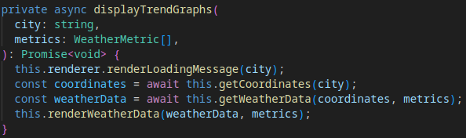
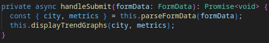
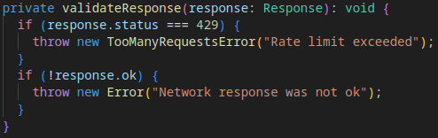
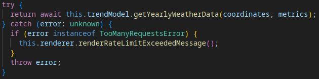
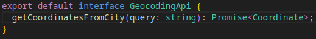
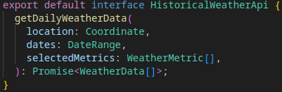
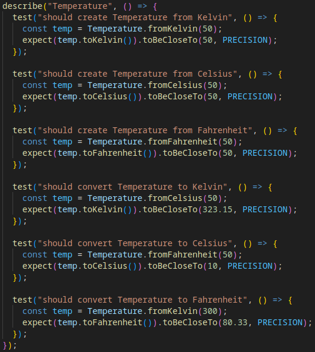
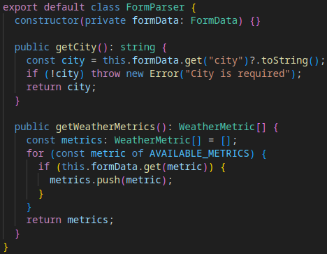
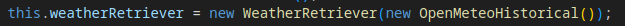

# Reflection on book chapters

## Chapter 2: Meaningful Names

At first I used the word `options` for the argument providing selected weather metrics to functions. But I realized that I was calling the same weather metrics `metrics` in other parts of the code. Therefore I changed `options` to `metrics` to make the naming consistent throughout the codebase (Pick One Word per Concept). I have also made sure to use intention-revealing names for variables and functions as you can see in the example below. `renderLoadingMessage()` explains exactly what the function does.

## Chapter 3: Functions

I use the single responsibility principle when writing functions in order to narrow down the responsibility for each one. This example function handles the form submit by parsing the form data, and sending it to another function for further processing. It just binds together smaller functions to achieve its goal, making it easy to read and understand at a glance.

## Chapter 4: Comments

In most of my code I have reduced the number of comments by making the code more self-explanatory. I have done this by using meaningful names for variables and functions, and by breaking down complex functions into smaller ones. However, comments are still useful in some places to, for example, explain the reason why something was done the way it was. Take this code snippet for example:

Without the comment, the one reading the code would likely have trouble understanding why the number is being rounded to ten decimal places.

## Chapter 5: Formatting

For this project I have decided to use Prettier with ESLint to automatically format my code. This will take care of many of the formatting guidelines mentioned in the book, such as indentation, line length, and vertical and horizontal openness. But the most important thing an automatic formatter does is to provide consistent code rules so that the code style looks the same even when multiple people are working on the same codebase.

72 character long line which Prettier considers too long:

Line shortened by breaking it into multiple lines:

This is an example of code with poor horizontal openness:

And how it looks after being formatted:

## Chapter 6: Objects and Data Structures

My code needs to handle a number of units such as Speed (for wind), Temperature, and Length (for rain and snow). I have decided that all these units should be objects rather than data structures, since "this makes it easy to add new kinds of objects without changing existing behaviors". In my code, all types of units for measuring weather extend an abstract `Unit` class. The `Unit` class has methods for adding units together by using an abstract `valueOf()` method implemented in each concrete subclass. Thus I will easily be able to create new units, such as Pressure, in the future without having to change existing code for adding two unit objects together.

Object hiding implementation details behind a layer of abstraction:

Data structure exposing its data and having no behavior:

## Chapter 7: Error Handling

Here I wrap the standard `fetch` error status codes to throw exceptions instead. This allows me to handle the errors in a more elegant way using try/catch further up the call stack. I also use a custom error class `TooManyRequestsError` which allows me to single out rate limiting errors to display a specific message to the user. The book puts emphasis on error handling not cluttering the code and making it less readable. I have tried to separate the error handling from the main logic by placing error handling code in separate functions like `validateResponse` below.

Throwing exceptions:

Handling same exceptions:

## Chapter 8: Boundaries

The screenshots show two interfaces I have created to separate my code from the third-party OpenMeteo API. This makes it so that the rest of my code doesn't have to know anything about the inner workings of the OpenMeteo API, and instead the code only has to communicate through the boundary of the interfaces. You can call this design pattern an Adapter or a Wrapper for the third-party boundary (The web API). The interfaces also make it easier to swap out the OpenMeteo API for another weather API in the future, since only the implementation of these interfaces would need to be changed.

Interface for retrieving coordinates from a location name:

Interface for retrieving historical weather data:

## Chapter 9: Unit Tests

I focused more on manual tests than automated tests for this project, but I wrote a few unit tests anyway. As the book suggests I have tried to minimize the number of asserts in each test in order to make it cleaner and easier to understand what the test is verifying at a glance. Each test also focuses on testing only one behavior of the class. For these classes I used test driven development (TDD) to write the tests first before implementing the classes. And I also tried to write my unit tests as cleanly as possible, since the book suggests that readability of tests is even more important than the readability of the main code.

## Chapter 10: Classes

In the screenshot below is the `FormParser` class which is responsible for getting the city name and selected weather metrics from the input form. Previously, these methods were part of a larger class, but I decided to extract them into their own class to adhere to the Single Responsibility Principle (SRP). The `FormParser` class now only has one reason to change, which is if the form structure changes. This makes the code more modular and easier to maintain. The resulting class has a high cohesion, since both methods use the same private field `formData`.

## Chapter 11: Systems

I have used dependency injection in order to decouple the weather API from the processing of weather data. This allows me to easily swap out the weather API implementation without changing the code that processes the weather data. In the example screenshot, the `WeatheRetriever` class receives an instance of `OpenMeteoHistorical`, which is an implementation of the interface `HistoricalWeatherApi`. This design reduces coupling between components and makes the system more flexible and easier to test.

