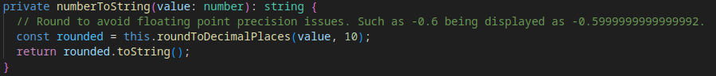
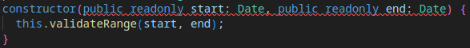
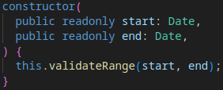
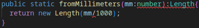
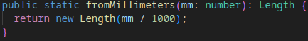
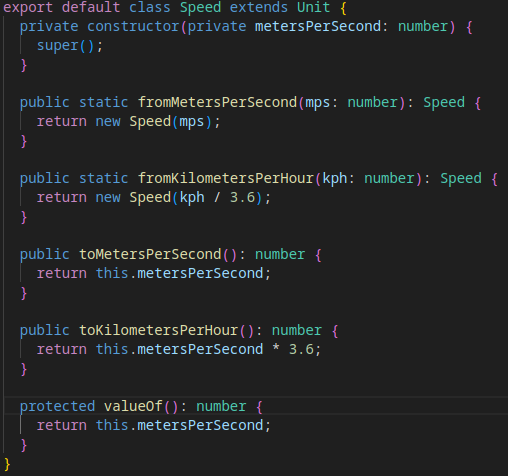
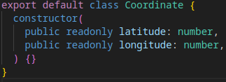

# Reflection on book chapters

## Chapter 2: Meaningful Names

## Chapter 3: Functions

## Chapter 4: Comments

In most of my code I have reduced the number of comments by making the code more self-explanatory. I have done this by using meaningful names for variables and functions, and by breaking down complex functions into smaller ones. However, comments are still useful in some places to, for example, explain the reason why something was done the way it was. Take this code snippet for example:

Without the comment, the one reading the code would likely have trouble understanding why the number is being rounded to ten decimal places.

## Chapter 5: Formatting

For this project I have decided to use Prettier with ESLint to automatically format my code. This will take care of many of the formatting guidelines mentioned in the book, such as indentation, line length, and vertical and horizontal openness. But the most important thing an automatic formatter does is to provide consistent code rules so that the code style looks the same even when multiple people are working on the same codebase.

72 character long line which Prettier considers too long:

Line shortened by breaking it into multiple lines:

This is an example of code with poor horizontal openness:

And how it looks after being formatted:

## Chapter 6: Objects and Data Structures

My code needs to handle a number of units such as Speed (for wind), Temperature, and Length (for rain and snow). I have decided that all these units should be objects rather than data structures, since "this makes it easy to add new kinds of objects without changing existing behaviors". In my code, all types of units for measuring weather extend an abstract `Unit` class. The `Unit` class has methods for adding units together by using an abstract `valueOf()` method implemented in each concrete subclass. Thus I will easily be able to create new units, such as Pressure, in the future without having to change existing code for adding two unit objects together.

Object hiding implementation details behind a layer of abstraction:

Data structure exposing its data and having no behavior:

## Chapter 7: Error Handling

